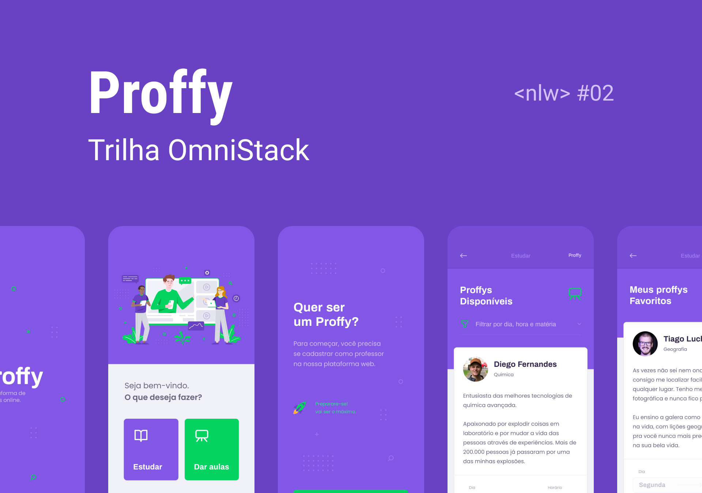
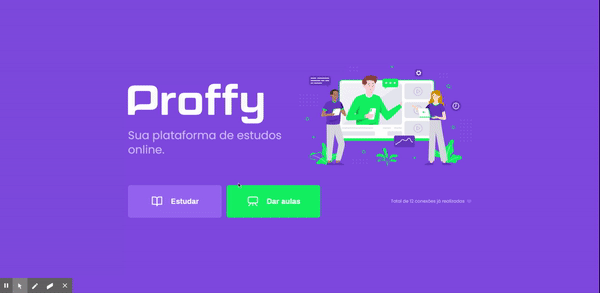

# Proffy     


<p align="center">
  
</p>

<p align="center">
  
</p>


[Content (en-US)](#secao-en_us)
[Conteúdo (pt-BR)](#secao-pt_br)

## About the project <a id="secao-en_us"></a>

Proffy is a platform that connects students aiming to get classes to teachers willing to teach the most varied school subjects, and has been developed during the second edition of Rocketseat's Next Level Week. In the project, it's possible to add a lot of classes, where the teacher can register his info, subjects and his available schedule to give classes. It's also possible search between registered classes, where the user choose the subject, week day and the hour of the day chosen to see if there is an available class.

## Content 
  * [How to execute the project](#installation)
    * [Installation - Back-end](#installation-back)
    * [Installation - Front-end](#installation-front)
    * [Installation - Mobile](#installation-mobile)

## How to execute the project <a id="installation"></a>
To execute the project, you'll need to have Node and NPM or Yarn installed to setup all the dependencies.


### Installation - Back-end (Server and API) <a id="installation-back"></a>

```bash
cd server
npm install
npm run knex:migrate
npm run start
```

If you are using Yarn, use this:
```bash
cd server
yarn install
yarn knex:migrate
yarn start
```

### Installation - Front-end (Web) <a id="installation-front"></a>

```bash
cd web
npm install
npm start
```

If you are using Yarn, use this:
```bash
cd web
yarn install
yarn start
```

After finishing installation, the web page will be open in your browser.

### Installation - Mobile (App) <a id="installation-mobile"></a>

Go to `api.ts` file inside `mobile/src/services` and change to your machine's server ip.
If you need to install *Expo*, execute the following command: `yarn global add expo-cli`.
After, execute the project.


```bash
cd mobile
npm install
npm start
```

If you are using Yarn, use this:
```bash
cd mobile
yarn install
yarn start
```

When executing the project, *Expo's* debug page will open in your browser.

To open the app in your mobile device, download *Expo's* app at Play Store or App Store and scan the QR code shown in the debug page, and wait until the installation finishes.

---

## Sobre o projeto <a id="secao-pt_br"></a>

O Proffy é uma plataforma que conecta alunos em busca de receber aulas a professores dispostos a ensinar as mais variadas disciplinas escolares, e foi desenvolvido durante a Next Level Week #02 da Rocketseat. No projeto, é possível adicionar várias aulas, onde o professor cadastra seus dados, a matéria e os horários disponíveis para dar aula. Também é possível buscar entre as aulas cadastradas, onde o usuário diz qual a matéria, dia da semana e horário do dia que quer buscar a aula.

## Conteúdos 
  * [Como executar o projeto](#instalacao)
    * [Instalação - Back-end](#instalacao-back)
    * [Instalação - Front-end](#instalacao-front)
    * [Instalação - Mobile](#instalacao-mobile)

## Como executar o projeto <a id="instalacao"></a>
Para executar o projeto, você irá precisar ter o Node e o NPM ou Yarn instalados para baixar as dependências.


### Instalação - Back-end (Server e API) <a id="instalacao-back"></a>

```bash
cd server
npm install
npm run knex:migrate
npm run start
```

Se estiver usando Yarn, utilize
```bash
cd server
yarn install
yarn knex:migrate
yarn start
```

### Instalação - Front-end (Web) <a id="instalacao-front"></a>

```bash
cd web
npm install
npm start
```

Se estiver usando Yarn, utilize
```bash
cd web
yarn install
yarn start
```

Quando terminar, a página da aplicação web será aberta no navegador.

### Instalação - Mobile (Aplicativo) <a id="instalacao-mobile"></a>

Vá no arquivo `api.ts` dentro de `mobile/src/services` e coloque o ip da máquina que está executando o seu servidor.
Se precisar instalar o *Expo*, execute o comando `yarn global add expo-cli`.
Em seguida, execute o projeto

```bash
cd mobile
npm install
npm start
```

Se estiver usando Yarn, utilize
```bash
cd mobile
yarn install
yarn start
```

Ao executar o projeto, a página de debug do *Expo* será aberta no seu navegador. 

Para executar o aplicativo no seu dispositivo, baixe o aplicativo *Expo* na Play Store ou App Store e faça o scan do código QR que será disponibilizado na página de debug, e aguarde a instalação.

---
###### Developed on Next Level Week from [RocketSeat](https://rocketseat.com.br) :rocket:.